# 1.计算机系统概述

## 1.1操作系统的基本概念

## 1.2操作系统发展历程

## 1.3操作系统的运行环境

## 1.6虚拟机

# 2.进程与线程

## 2.1进程与线程

## 2.2CPU调度

## 2.3同步与互斥

## 2.4死锁

# 3.内存管理

## 3.1内存管理概念

### 1.

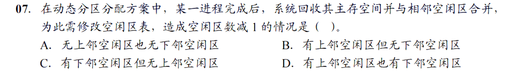

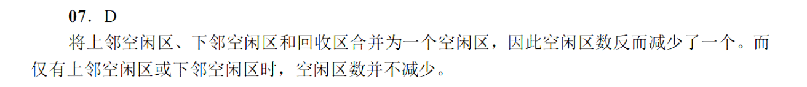

### 2.

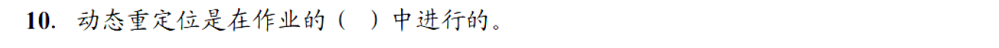

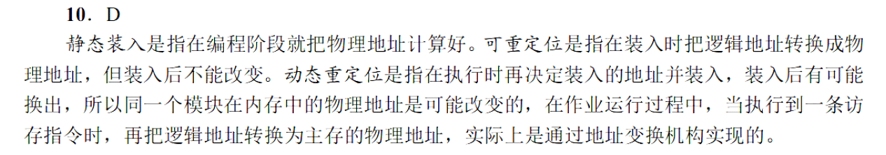

### 3.

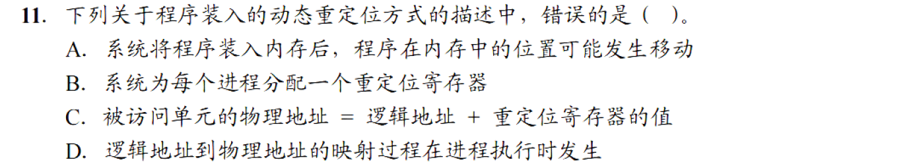

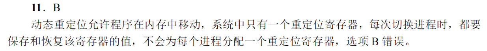

### 4.

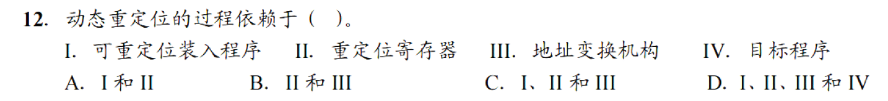

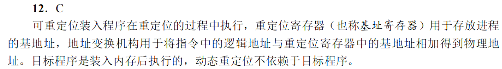

### 5.

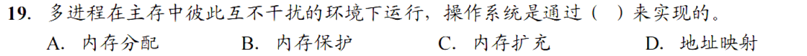

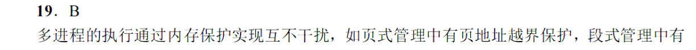

### 6.

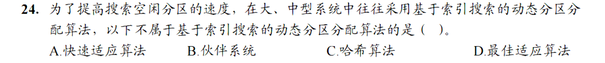

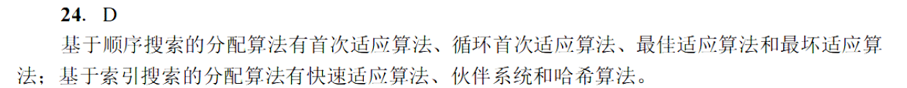

### 7.

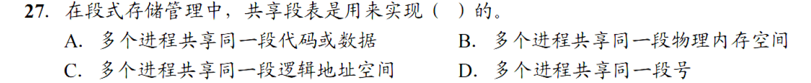

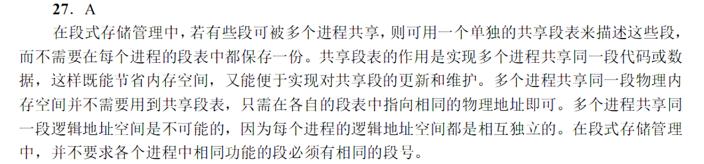

### 8.

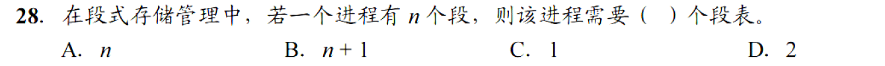

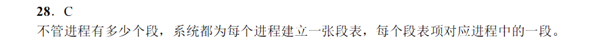

### 9.

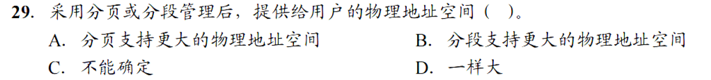

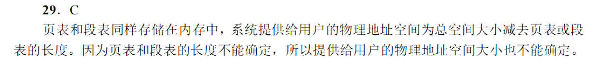

### 10.

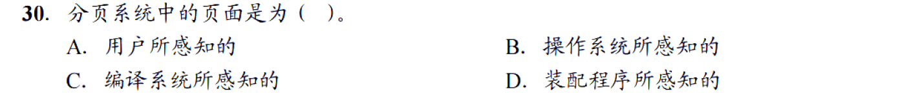

### 11.

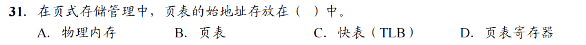

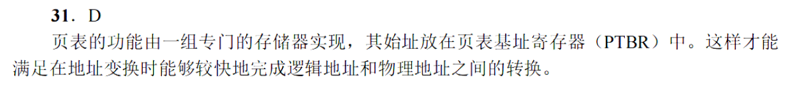

### 12.

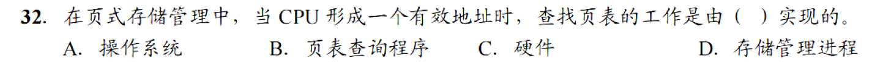

C

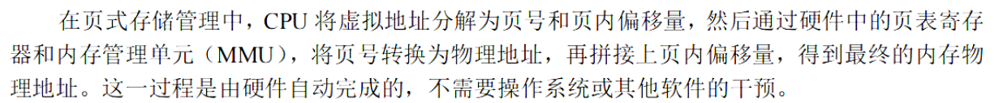

### 13.

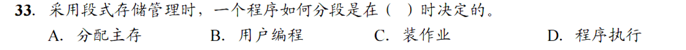

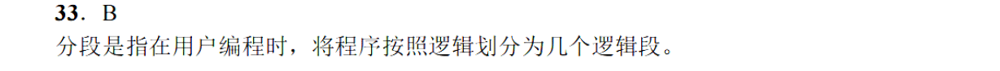

### 14.

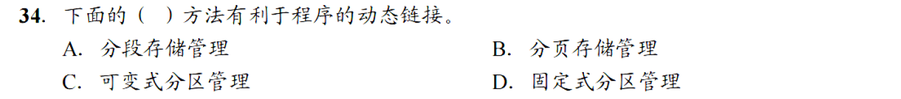

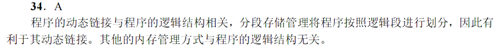

### 15.

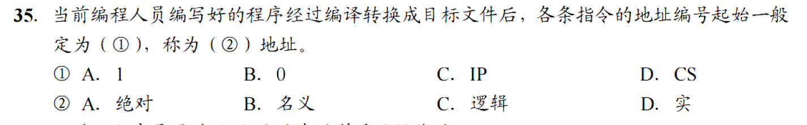

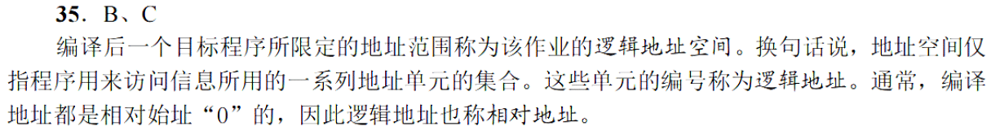

### 16.

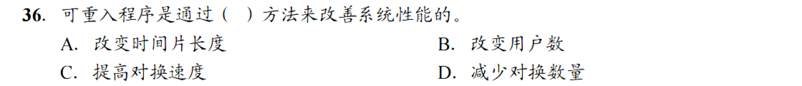

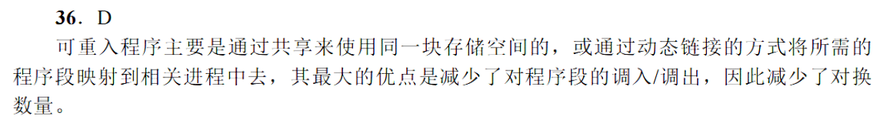

### 17.

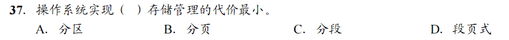

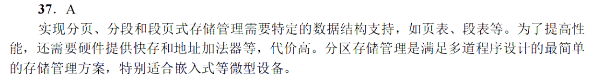

### 18.

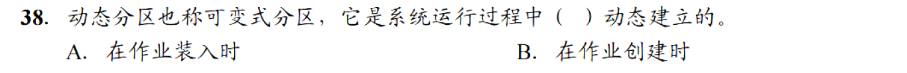

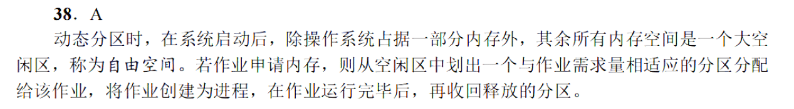

### 19.

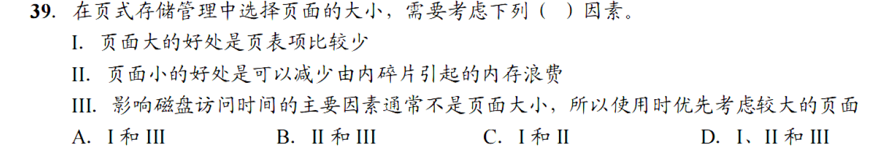

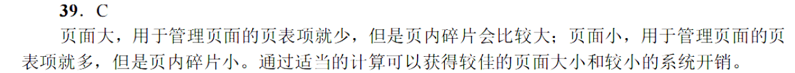

### 20.

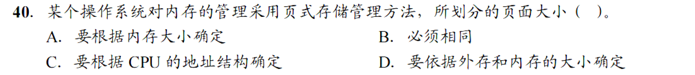

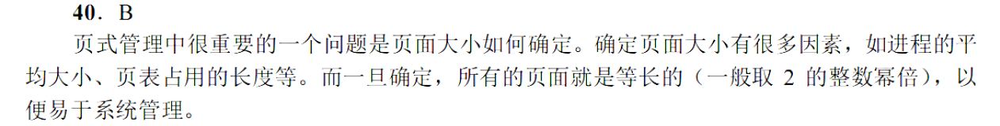

### 21.

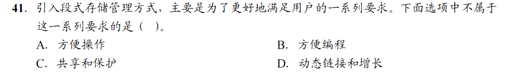

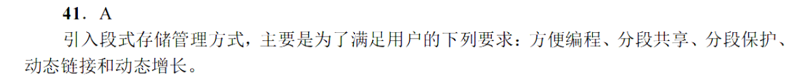

### 22.

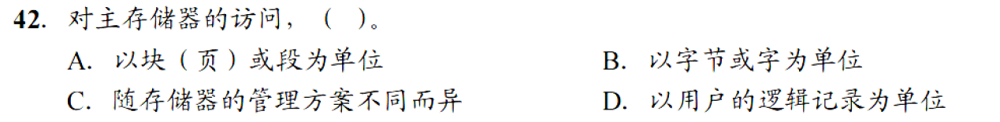

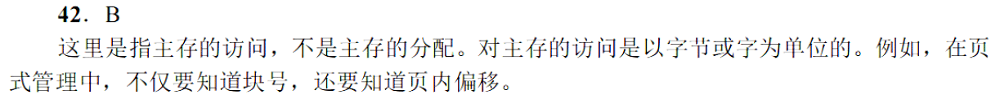

### 23.

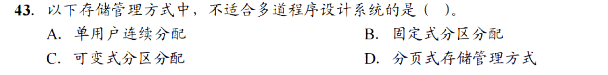

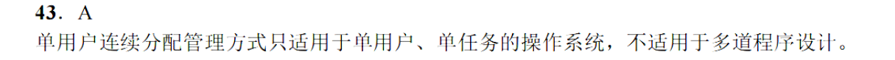

### 24.

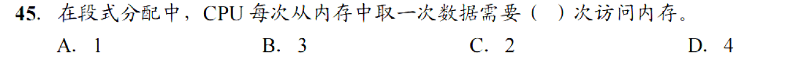

C

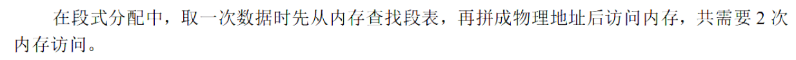

### 25.

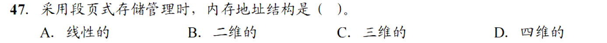

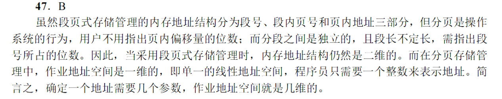

### 26.

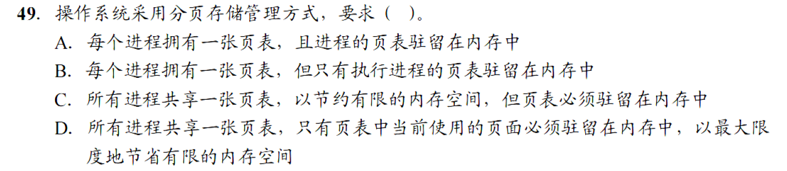

### 27.

### 28.

### 29.

### 30.

### 31.

### 32.

### 33.

### 34.

### 35.

### 36.

### 37.

### 38.

### 真题：

## 3.2虚拟内存

### 1.

### 2.

### 3.

### 4.

### 5.

### 6.

### 7.

### 8.

### 9.

### 10.

### 11.

### 12.

### 13.

### 14.

### 15.

### 16.

### 17.

### 18.

### 19.

### 20.

### 21.

### 22.

### 23.

### 24.

### 25.

# 4.文件管理

## 4.1文件系统基础

## 4.2目录

## 4.3文件系统

# 5.输入输出管理

## 5.1I/O管理概述

## 5.2设备独立性软件

## 5.3磁盘和固态硬盘

### 1.

### 2.

### 3.

### 4.

### 5.

### 6.

### 7.

### 8.

### 9.

### 10.

### 11.

### 12.

### 13.

### 14.

### 15.

### 16.

### 17.

### 18.

### 19.

### 20.

### 21.

### 22.