# 1.计算机系统概述

## 1.1操作系统的基本概念

### 1.

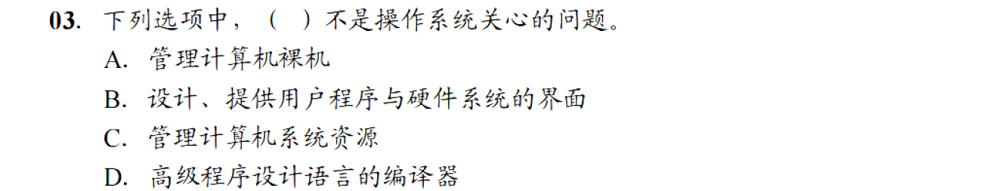

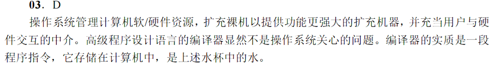

### 2.

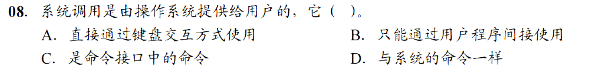

### 3.

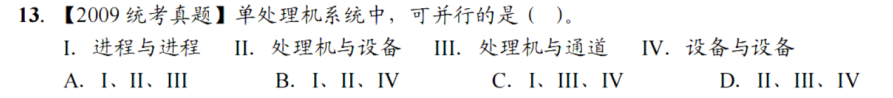

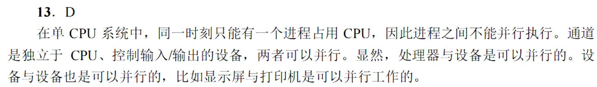

## 1.2操作系统发展历程

### 1.

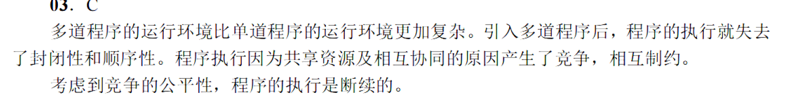

### 2.

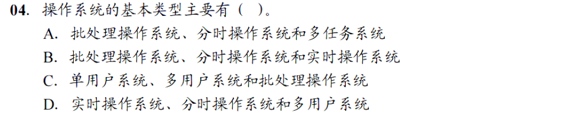

B

### 3.

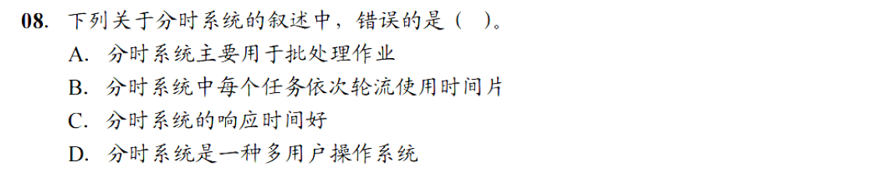

A

### 4.

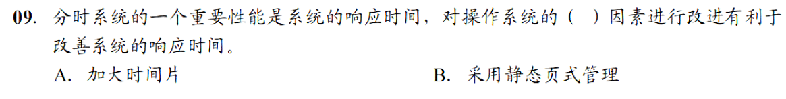

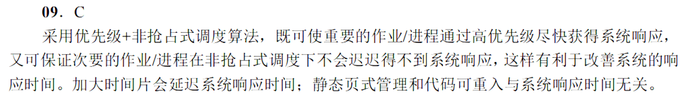

### 5.

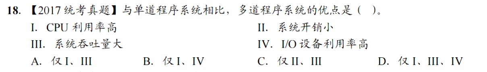

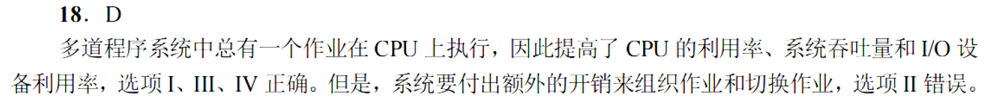

## 1.3操作系统的运行环境

### 1.

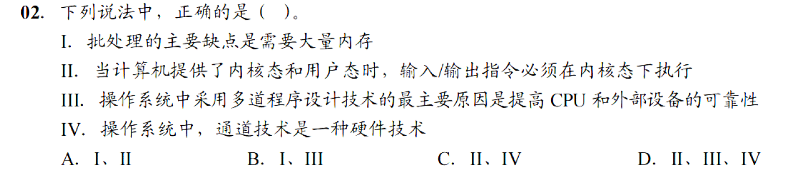

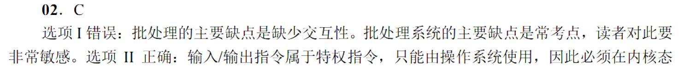

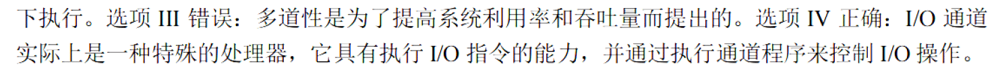

### 2.

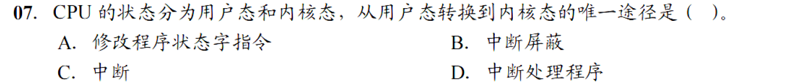

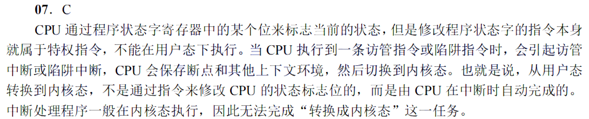

### 3.

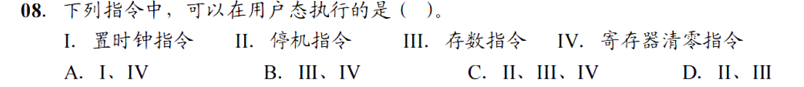

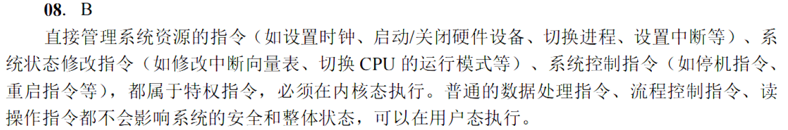

### 4.

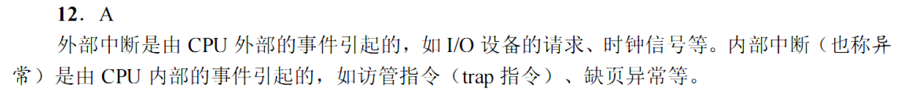

### 5.

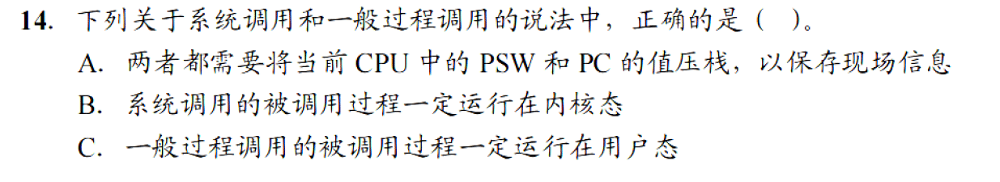

### 6.

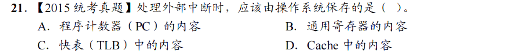

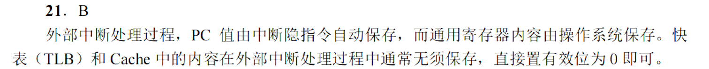

### 7.

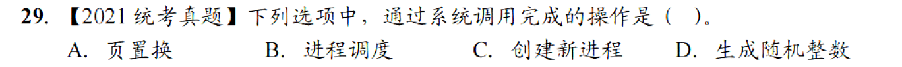

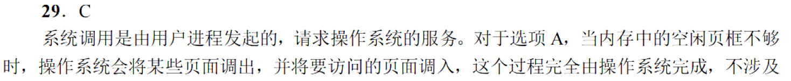

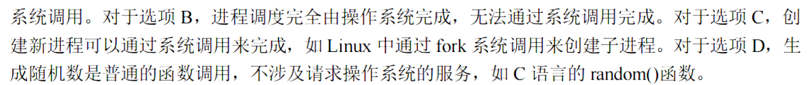

### 8.

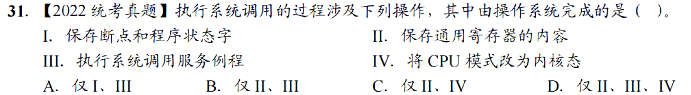

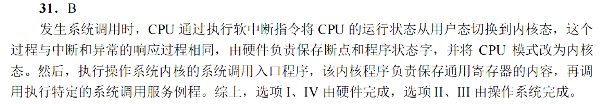

### 真题：

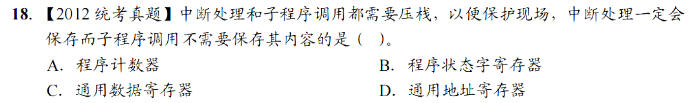

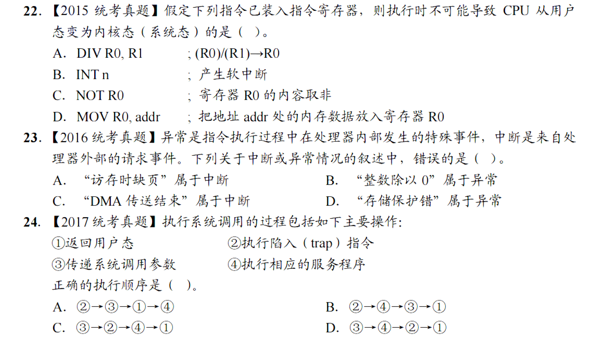

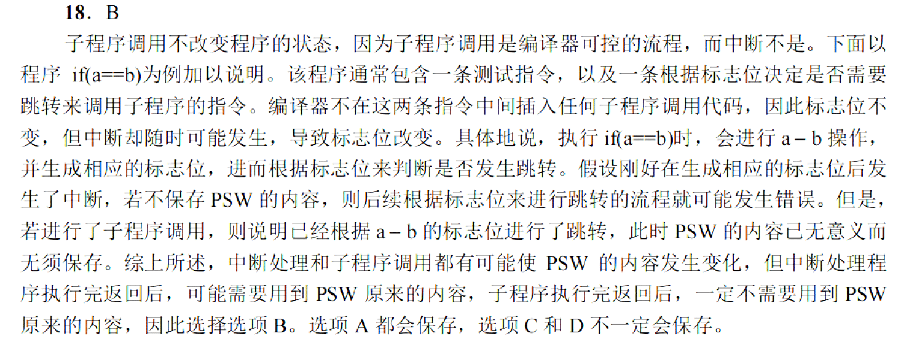

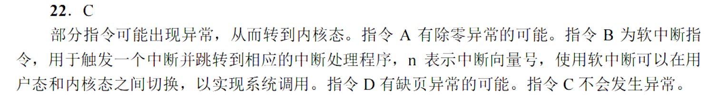

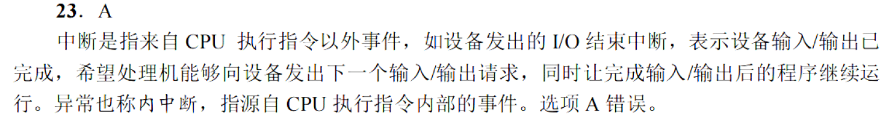

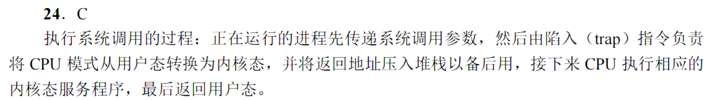

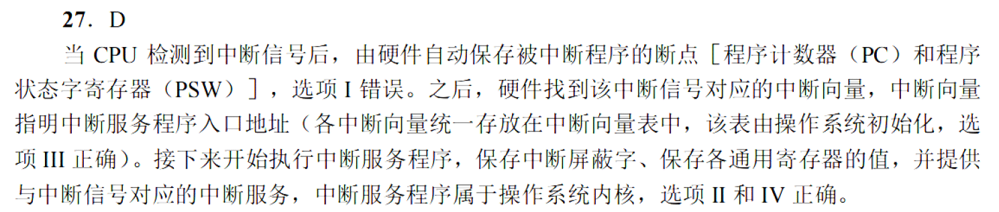

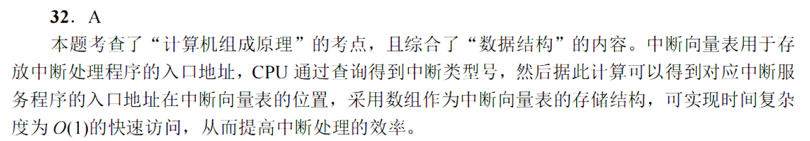

## 1.6虚拟机

### 1.

### 2.

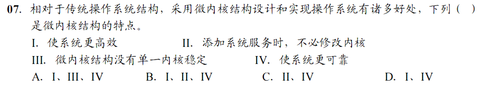

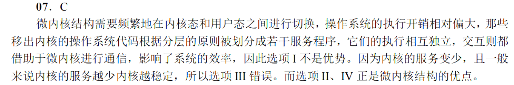

### 3.

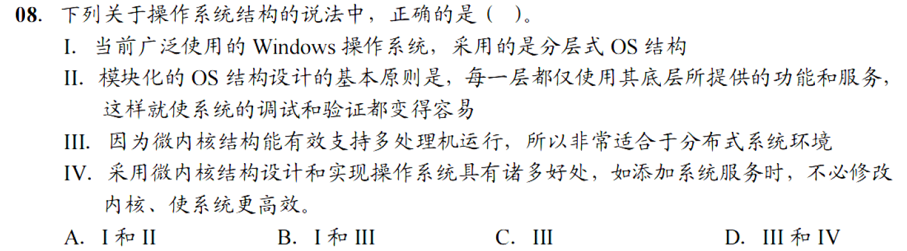

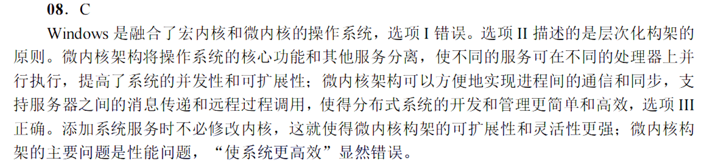

### 4.

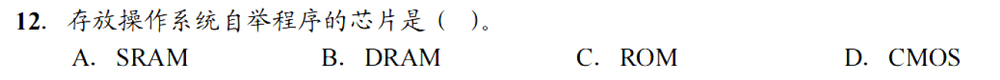

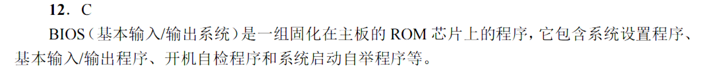

### 5.

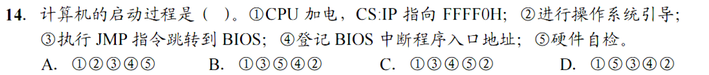

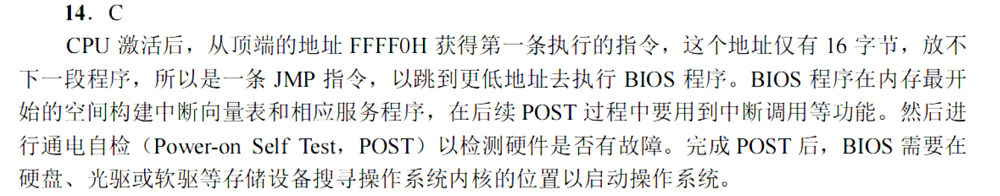

### 6.

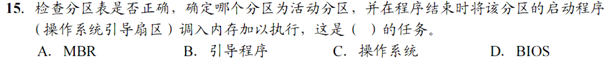

A

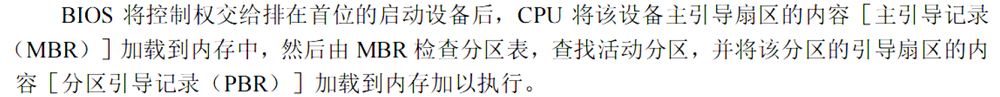

### 7.

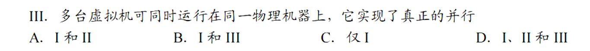

### 8.

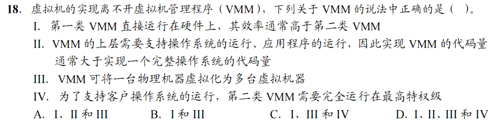

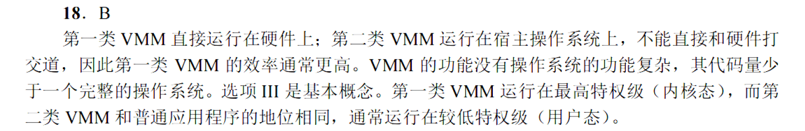

### 真题：

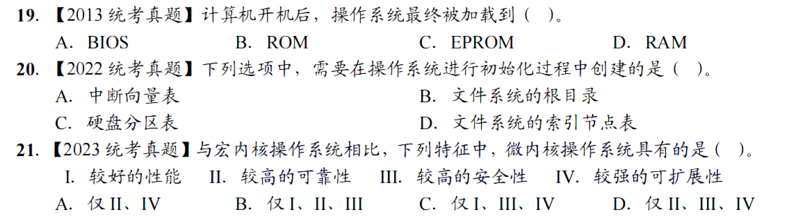

# 2.进程与线程

## 2.1进程与线程

### 1.

### 2.

### 3.

### 4.

### 5.

### 6.

### 7.

### 8.

### 9.

### 10.

### 11.

### 12.

D

### 13.

### 14.

### 15.

### 16.

### 17.

### 18.

### 19.

### 20.

### 21.

### 22.

### 23.

### 24.

### 真题：

## 2.2CPU调度

### 1.

### 2.

### 3.

### 4.

### 5.

### 6.

### 7.

### 8.

### 9.

### 10.

### 11.

A

### 12.

### 13.

### 14.

### 15.

### 16.

### 17.

### 18.

### 19.

### 20.

### 真题：

## 2.3同步与互斥

### 1.

### 2.

### 3.

### 4.

D

### 5.

C

### 6.

A

### 7.

C

### 8.

### 9.

### 10.

### 11.

### 12.

### 13.

### 14.

### 15.

### 16.

### 17.

### 18.

### 19.

### 20.

### 21.

### 22.

C

### 23.

C

### 真题：

## 2.4死锁

### 1.

### 2.

### 3.

鸽笼原理

### 4.

### 5.

### 6.

### 7.

### 8.

### 9.

### 10.

### 11.

### 12.

# 3.内存管理

## 3.1内存管理概念

### 1.

### 2.

### 3.

### 4.

### 5.

### 6.

### 7.

### 8.

### 9.

### 10.

### 11.

### 12.

C

### 13.

### 14.

### 15.

### 16.

### 17.

### 18.

### 19.

### 20.

### 21.

### 22.

### 23.

### 24.

C

### 25.

### 26.

### 27.

### 28.

### 29.

### 30.

### 31.

### 32.

### 33.

### 34.

### 35.

### 36.

### 37.

### 38.

### 真题：

## 3.2虚拟内存

### 1.

### 2.

### 3.

### 4.

### 5.

### 6.

### 7.

### 8.

### 9.

### 10.

### 11.

### 12.

### 13.

### 14.

### 15.

### 16.

### 17.

### 18.

### 19.

### 20.

### 21.

### 22.

### 23.

### 24.

### 25.

# 4.文件管理

## 4.1文件系统基础

### 1.

### 2.

### 3.4.

### 5.

### 6.

D

### 7.

### 8.

### 9.

### 10.11.12.

### 13.

### 14.15.

### 16.

、磁盘地址是32位即4B，4KB/4B=1K

### 17.

### 18.19.

### 20.21.22.23.24

### 25.

## 4.2目录

### 1.

### 2.

### 3.

### 4.

### 5.

### 6.

## 4.3文件系统

### 1.

### 2.3.4.

### 5.6.7.

### 8.9.10.11.12.

### 真题

# 5.输入输出管理

## 5.1I/O管理概述

## 5.2设备独立性软件

### 真题：

## 5.3磁盘和固态硬盘

### 真题：

### 1.

### 2.

### 3.

### 4.

### 5.

### 6.

### 7.

### 8.

### 9.

### 10.

### 11.

### 12.

### 13.

### 14.

### 15.

### 16.

### 17.

### 18.

### 19.

### 20.

### 21.

### 22.