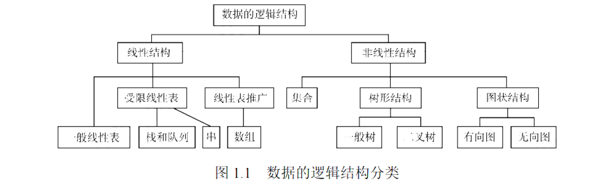
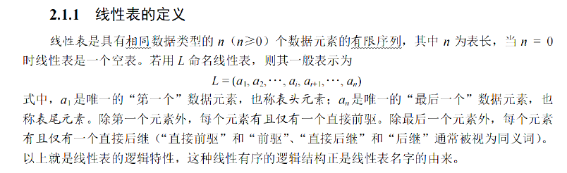
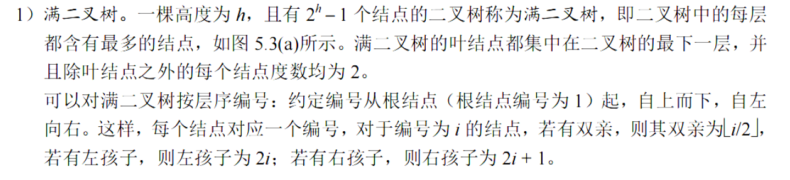
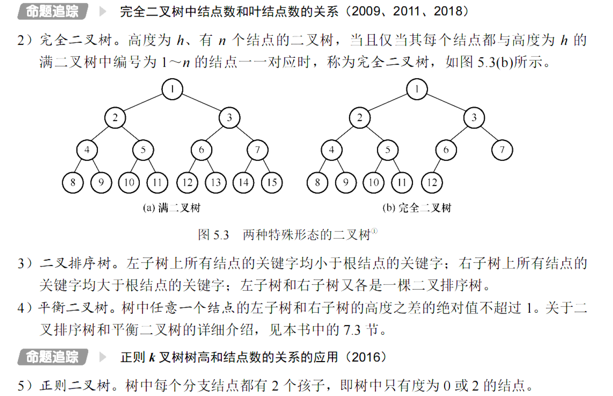
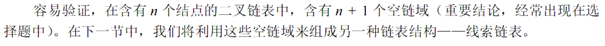
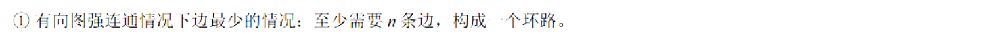
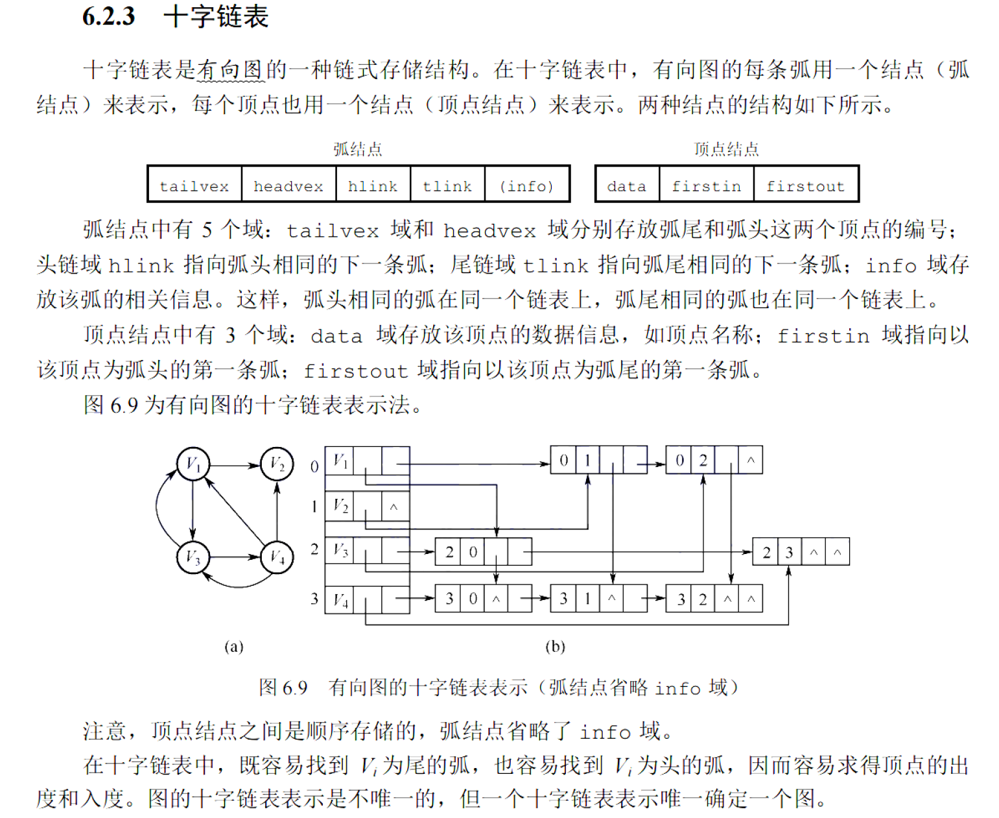
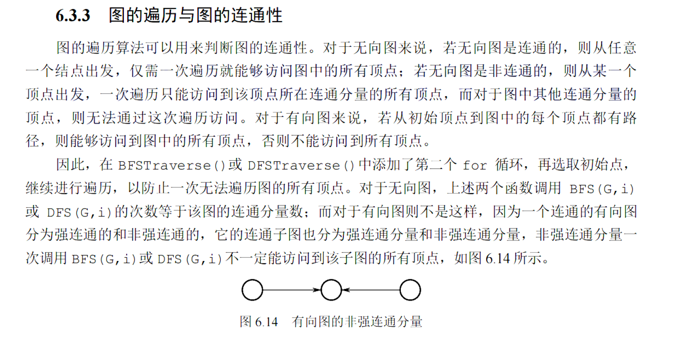

# 1.绪论

## 数据三要素

### 逻辑结构

- 几何
- 线性结构
- 树形结构
- 图/网状结构

### 存储结构

- 顺序存储
- 链式存储
- 索引存储
- 散列存储

### 运算

## 算法的五个特性

- 有穷性
- 确定性
- 可行性
- 输入
- 输出

# 2.线性表

## 2.1线性表的定义和基本操作

## 2.2线性表的顺序表示

- 初始化
- 插入
- 删除
- 按值查找

算法题：双指针满足条件移动！！

## 2.3线性表的链式表示

- 单链表
  - 初始化
  - 求表长
  - 按序号找节点
  - 按值找节点
  - 插入节点
  - 删除节点
  - 头插法（倒序）
  - 尾插法
- 双链表
  - 插入
  - 删除
- 循环单链表
- 循环双链表

- 静态链表

注意头，尾节点，哨兵节点

快慢指针！！

使用头插法可实现原地倒序

快慢指针

哈希计数

# 3.栈，队列，数组

## 3.1栈

## 3.2队列

## 3.3栈与队列的应用

## 3.4数组与特殊矩阵

# 4.串

## 4.1串的定义

## 4.2串的模式匹配

# 5.树与二叉树

## 5.1树的基本概念

## 5.2二叉树的概念

### 二叉树与度为2的有序树的区别

### 特殊的二叉树

### 二叉树的性质

## 5.3二叉树的遍历和线索二叉树

## 5.4树，森林

## 5.5树与二叉树的应用

# 6.图

## 6.1图的基本概念

## 6.2图的存储及基本操作

### 邻接矩阵

### 邻接表法

### 十字链法

### 临接多重表

### 总结

## 6.3图的遍历

## 6.4图的应用

# 7.查找

## 7.2顺序查找和折半查找

## 7.3树形查找

## 7.4B树与B+树

## 7.5散列表

# 8.排序

## 8.1排序的基本概念

## 8.2插入排序

## 8.3交换排序

## 8.4选择排序

## 8.5归并排序，基数排序和计数排序

## 8.6内部排序的比较与应用

## 8.7外部排序