# 1.绪论

## 1.1数据结构的基本概念

### 1.


### 2.


## 1.2.算法与算法评价

### 1.


### 2.


### 3.

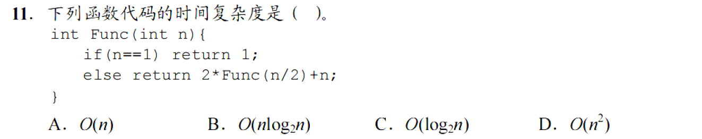


# 2.线性表

## 2.1线性表的定义和基本操作

### 1.


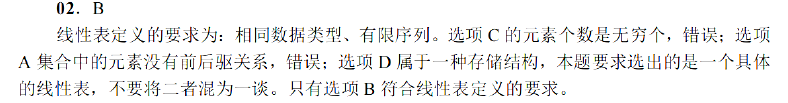

## 2.2线性表的顺序表示

### 1.


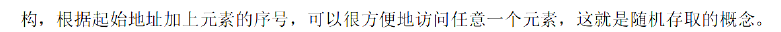

### 2.

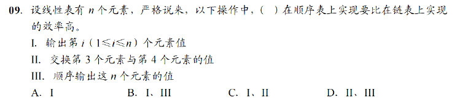


### 3./4.


## 2.3线性表的链式表示

### 1.


A；注意节点内

### 2.


### 3.


C

### 4.


##### 选项C：头结点的指针域与L的值相等

- **解释**：在循环单链表中，`L`是指向头结点的指针。如果链表为空，那么头结点是链表中唯一的节点，它的`next`指针（即指针域）应该指向自己，因为链表中没有其他节点可以指向。因此，如果头结点的指针域（`next`）与`L`的值相等，这意味着`L`指向的节点的`next`指针也指向`L`所指向的节点，形成一个指向自己的循环，这是空循环链表的定义。

- **图示**：

  ```
  L -> 头结点 -> 头结点 (next 指向自己)
  ```

  

##### 选项D：头结点的指针域与L的地址相等

- **解释**：这个选项描述的情况实际上是不可能发生的。在C或C++等语言中，变量（如指针）的地址是一个内存地址，而指针变量的值是它所指向的内存地址。头结点的指针域（`next`）存储的是下一个节点的地址，而不是`L`这个指针变量的地址。`L`是一个独立的指针变量，它的地址与它所指向的任何节点的地址都是不同的。因此，头结点的指针域不可能与`L`的地址相等。

### 5.


A

### 6.


### 7.


### 8.


# 3.栈，队列，数组

## 3.1栈

1，9，21，23，29

### 1.


B。线性结构

### 2.

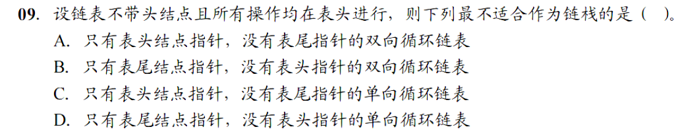

C

### 3.

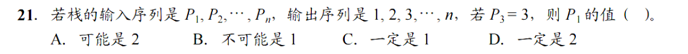


### 4.


### 5.

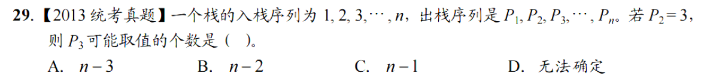

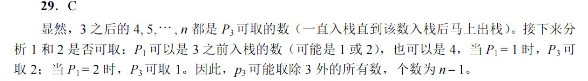

上溢：写满了还往里面写

下溢：读空了还往外面读

## 3.2队列

5，6，9，11，12，15，16，21

### 1.


### 2.


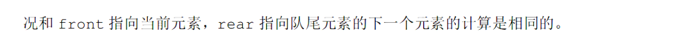

#### tips：

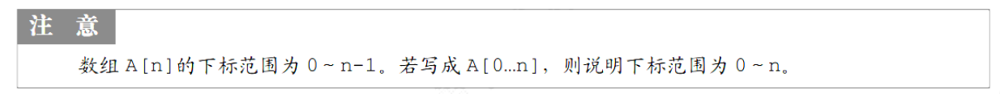

### 3.


### 4.


### 5.


### 6.


### 7.

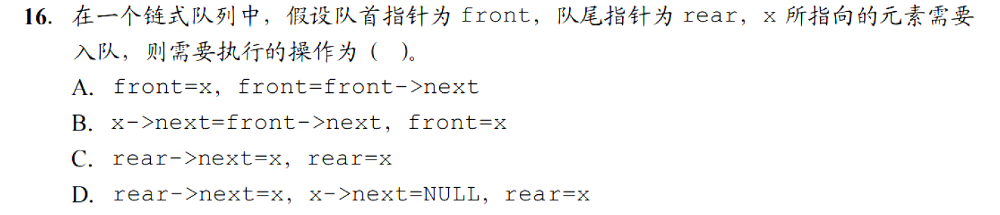


#### tips：选项要看全看完，比较出最优的

### 8.


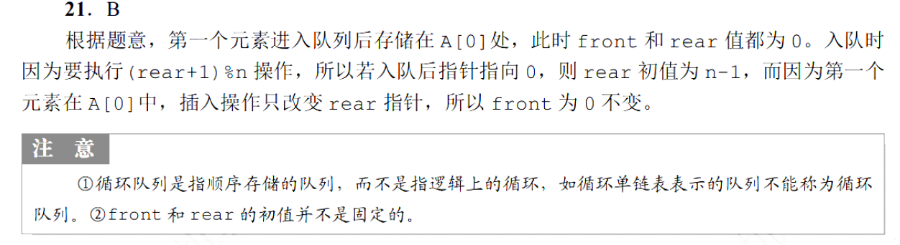

### 真题：

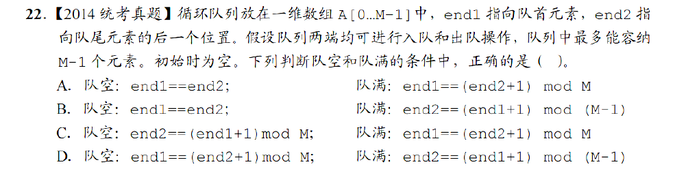


## 3.3栈与队列的应用

6，13，16

### 1.


C

### 2.


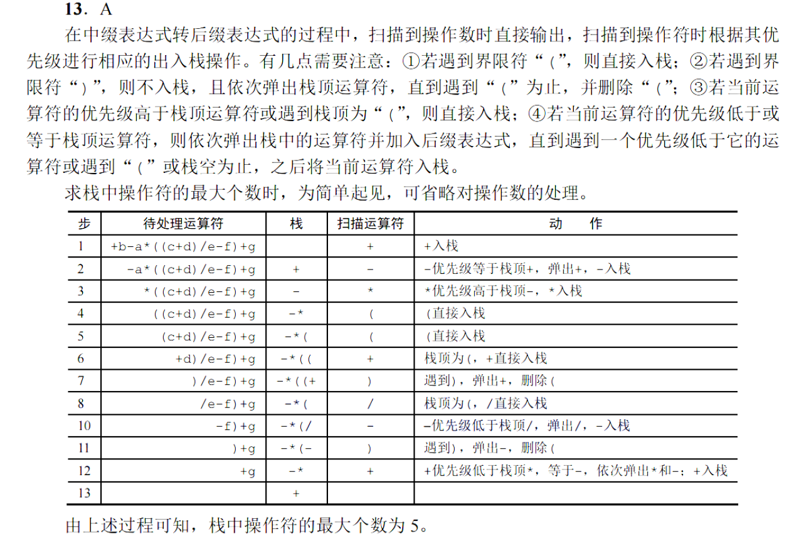

### 3.


### 真题：


#### tips：

11题


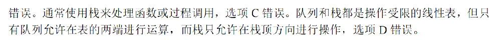

## 3.4数组与特殊矩阵

4，10，13，14

### 1.


D

### 2.


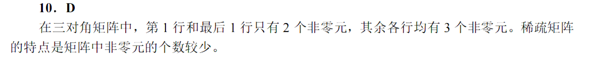

### 3.


#### tips：数组从0开始计数

### 4.

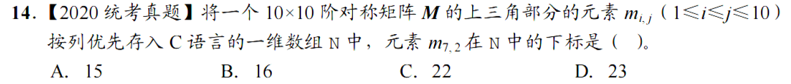


### 真题：


# 4.串

## 4.2串的模式匹配

11.12，13

### 1.


### 2.


### 3.


# 5.树与二叉树

## 5.1树的基本概念

### 1.


### 2.


## 5.2二叉树的概念

2，16，19，23，29

### 1.


### 2.

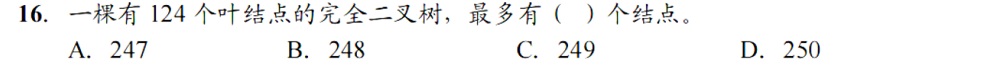


### 3.


### 4.


### 5.


### 真题：


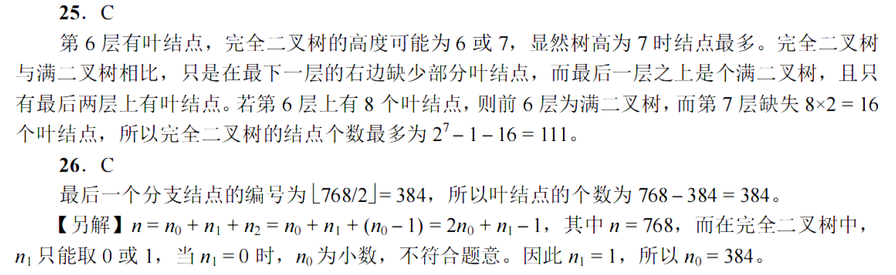

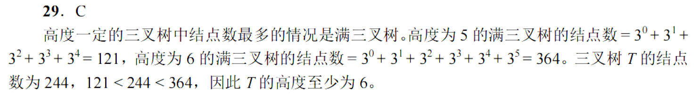

## 5.3二叉树的遍历和线索二叉树

4，10，12，13，21，23，27，28，31，36与32，37，40

### 1.


### 2.


### 3.


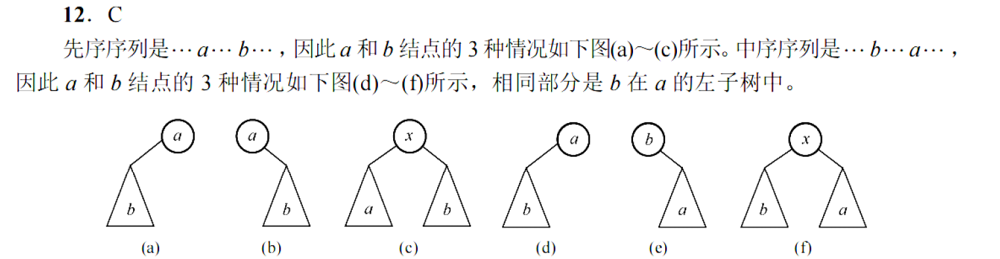

前序：中左右；

中序：左中右

### 4.

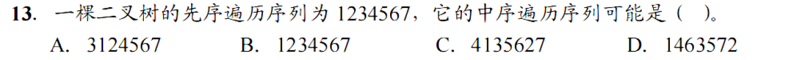


### 5.

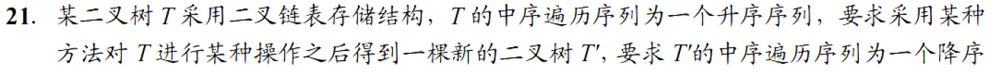

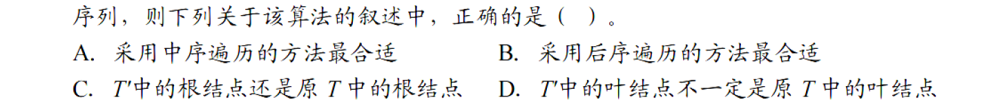


### 6.


### 7.


### 8.


### 9.

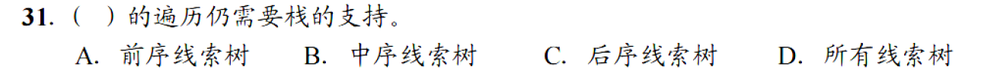


### 10.


### 11.


### 12.


### 13.


## 5.4树，森林

1，5

## 5.5树与二叉树的应用

2，3，12，13，18，21

# 6.图

## 6.1图的基本概念

1，4，6，7，11

## 6.2图的存储及基本操作

4，8

## 6.3图的遍历

2，3，4，7，13，17

## 6.4图的应用

1，3，4，7，11，13，14，15，16，19，24，25，28，29，31，33，34，36，39，40，41，45

# 7.查找

## 7.2顺序查找和折半查找

8，9，15，17，21，23

## 7.3树形查找

1，9，13，15，17，18，31

## 7.4B树与B+树

2，3，5，6，7，8，9，10，11，13，16，19，21，22，23

## 7.5散列表

1，4，5，6，13，14，16，19，21，23

# 8.排序

## 8.1排序的基本概念

## 8.2插入排序

11

## 8.3交换排序

4，7，10，12，18

## 8.4选择排序

7，9，13，16，17

## 8.5归并排序，基数排序和计数排序

4，8，11，13

## 8.6内部排序的比较与应用

7，10，11，12，17

## 8.7外部排序

3，4，6，9，10，11，14