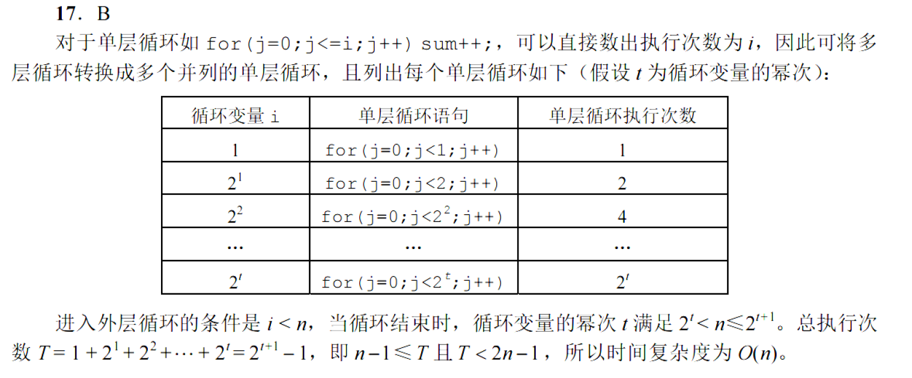

# 1.绪论

## 1.1数据结构的基本概念

## 1.2.算法与算法评价

# 2.线性表

## 2.1线性表的定义和基本操作

## 2.2线性表的顺序表示

## 2.3线性表的链式表示

# 3.栈，队列，数组

## 3.1栈

## 3.2队列

## 3.3栈与队列的应用

## 3.4数组与特殊矩阵

# 4.串

## 4.1串的定义

## 4.2串的模式匹配

# 5.树与二叉树

## 5.1树的基本概念

## 5.2二叉树的概念

## 5.3二叉树的遍历和线索二叉树

## 5.4树，森林

## 5.5树与二叉树的应用

# 6.图

## 6.1图的基本概念

## 6.2图的存储及基本操作

## 6.3图的遍历

## 6.4图的应用

# 7.查找

## 7.2顺序查找和折半查找

## 7.3树形查找

## 7.4B树与B+树

## 7.5散列表

# 8.排序

## 8.1排序的基本概念

## 8.2插入排序

## 8.3交换排序

## 8.4选择排序

## 8.5归并排序，基数排序和计数排序

## 8.6内部排序的比较与应用

## 8.7外部排序