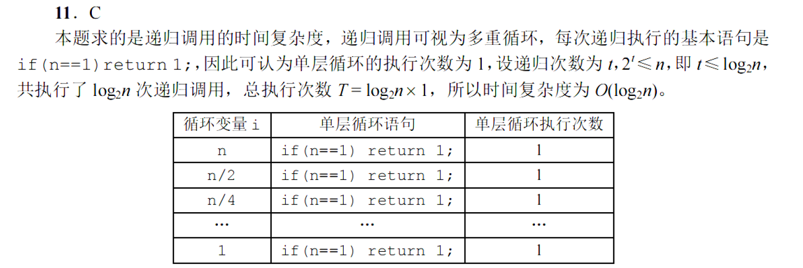
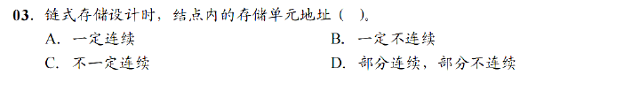
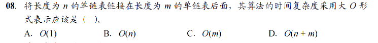
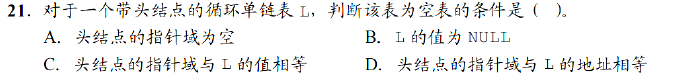
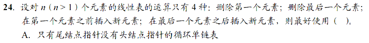
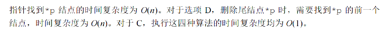

# 1.绪论

## 1.1数据结构的基本概念

### 1.


### 2.


## 1.2.算法与算法评价

### 1.


### 2.


### 3.




# 2.线性表

## 2.1线性表的定义和基本操作

### 1.


## 2.2线性表的顺序表示

### 1.


### 2.


### 3./4.


## 2.3线性表的链式表示

### 1.



A；注意节点内

### 2.


### 3.



C

### 4.



##### 选项C：头结点的指针域与L的值相等

- **解释**：在循环单链表中，`L`是指向头结点的指针。如果链表为空，那么头结点是链表中唯一的节点，它的`next`指针（即指针域）应该指向自己，因为链表中没有其他节点可以指向。因此，如果头结点的指针域（`next`）与`L`的值相等，这意味着`L`指向的节点的`next`指针也指向`L`所指向的节点，形成一个指向自己的循环，这是空循环链表的定义。

- **图示**：

  ```
  L -> 头结点 -> 头结点 (next 指向自己)
  ```

  

##### 选项D：头结点的指针域与L的地址相等

- **解释**：这个选项描述的情况实际上是不可能发生的。在C或C++等语言中，变量（如指针）的地址是一个内存地址，而指针变量的值是它所指向的内存地址。头结点的指针域（`next`）存储的是下一个节点的地址，而不是`L`这个指针变量的地址。`L`是一个独立的指针变量，它的地址与它所指向的任何节点的地址都是不同的。因此，头结点的指针域不可能与`L`的地址相等。

### 5.


A

### 6.






### 7.


### 8.


# 3.栈，队列，数组

## 3.1栈


## 3.2队列


## 3.3栈与队列的应用


## 3.4数组与特殊矩阵


# 4.串

## 4.1串的定义


## 4.2串的模式匹配


# 5.树与二叉树

## 5.1树的基本概念


## 5.2二叉树的概念


## 5.3二叉树的遍历和线索二叉树


## 5.4树，森林


## 5.5树与二叉树的应用


# 6.图

## 6.1图的基本概念


## 6.2图的存储及基本操作


## 6.3图的遍历


## 6.4图的应用


# 7.查找

## 7.2顺序查找和折半查找


## 7.3树形查找


## 7.4B树与B+树


## 7.5散列表


# 8.排序

## 8.1排序的基本概念


## 8.2插入排序


## 8.3交换排序


## 8.4选择排序


## 8.5归并排序，基数排序和计数排序


## 8.6内部排序的比较与应用


## 8.7外部排序