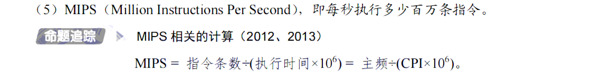

# 1.计算机系统概述

## 1.2计算机系统层次结构

## 1.3计算机的性能指标

# 2.数据的表示和运算

## 2.1数制与编码

## 2.2运算方法与运算电路

## 2.3浮点数的表示与运算

# 3.存储系统

## 3.1存储器的分类

### 多层次的存储系统

## 3.2主存储器

### SRAM与DRAM

### 只读存储器

### 主存储器的基本组成

### 多模块存储器

## 3.3主存储器与CPU的连接

### 主存容量的拓展

### 地址分配与片选

## 3.4外部存储器

### 磁盘

### 固态硬盘

## 3.5高速缓存存储器

### cache和主存的映射关系

#### 直接映射

#### 全相联映射

#### 组相联映射

### Cache的替换算法

### 一致性问题

## 3.6虚拟存储器

### 基本概念

### 页式虚拟存储

### 段式虚拟存储

### 段页式虚拟存储

### 虚拟存储与Cache的比较

# 4.指令系统

## 4.1指令系统

## 4.2指令的寻址方式

## 4.3程序的机器级代码表示

## 4.4CISC和RISC的基本概念

# 5.中央处理器

## 5.1CPU的功能和基本结构

## 5.2指令执行过程

## 5.3数据通路功能和基本结构

## 5.4控制器的功能和工作原理

## 5.5异常和中断机制

## 5.6指令流水线

## 5.7多处理器的基本概念

# 6.总线

## 6.1总线概述

## 6.2总线事务与定时

# 7.输入/输出系统

## 7.1I/O系统基本概念

## 7.2I/O接口

7.3I/O方式

