# 1.计算机系统概述

## 1.2计算机系统层次结构

1，2，7，13，18

### 1.

### 2.

### 3.

### 4.

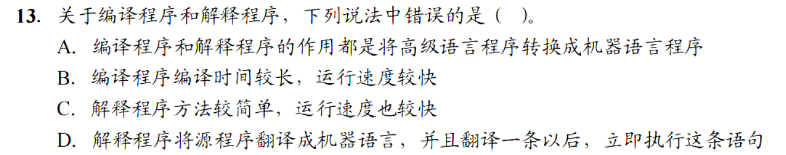

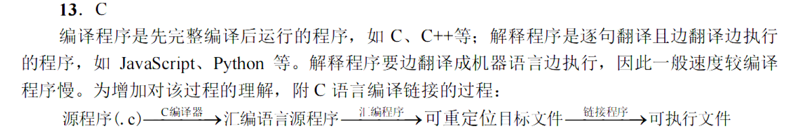

### 5.

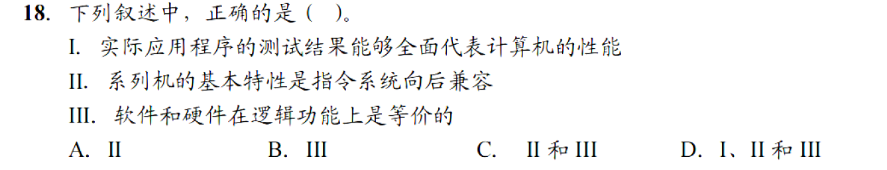

## 1.3计算机的性能指标

3，7，10，14，15，18，20，25，29，30，31，32

### 1.

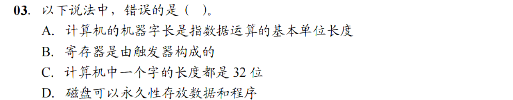

### 2.

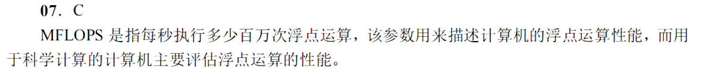

### 3.

### 4.

### 5.

### 6.

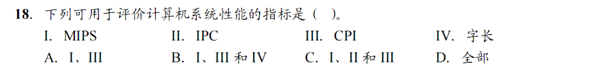

### 7.

### 8.

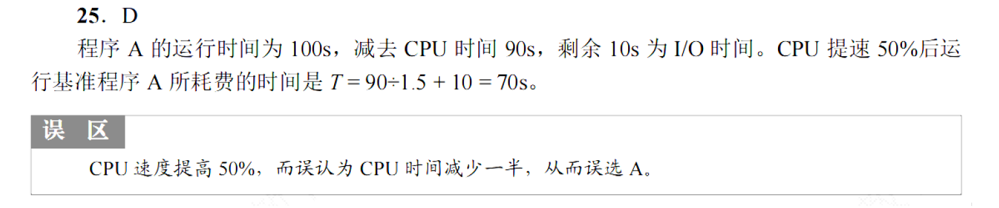

### 9.

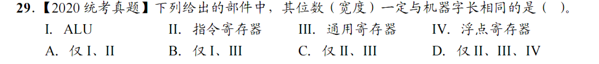

### 10.

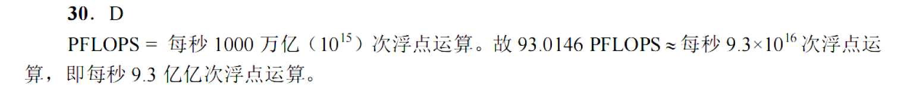

### 11.

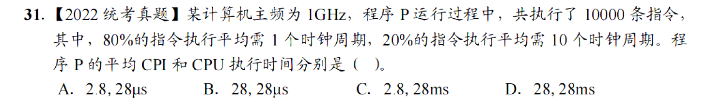

### 12.

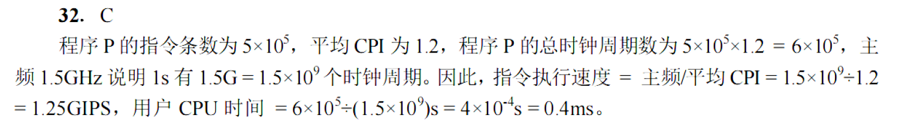

# 2.数据的表示和运算

## 2.1数制与编码

5，10，13，23，24

## 2.2运算方法与运算电路

2，5，9，12，13，18，20，21，22，23，25

## 2.3浮点数的表示与运算

todo

# 3.存储系统

## 3.1存储器的分类

1，4

### 1.

### 2.

### 3.

### 4.

## 3.2主存储器

3，4，12，13，14，15，16，17，19，22，23，25，27，30，31，33

### 1.

B

### 2.

### 3.

### 4.

### 5.

### 6.

### 7.

### 8.

### 9.

### 10.

### 11.

### 12.

### 13.

### 14.

### 15.

### 16.

## 3.3主存储器与CPU的连接

3，7，9，13，14，16

### 1.

### 2.

### 3.

### 4.

### 5.

### 6.

## 3.4外部存储器

2，5，6，11

### 1.

### 2.

### 3.

### 4.

### 真题：

C

## 3.5高速缓存存储器

1，2，6，9，11，14，15，16，17，19，20，21，22，23，25，26，29，30，31，32，33，34

### 1.

### 2.

### 3.

### 4.

### 5.

### 6.

### 7.

### 8.

### 9.

### 10.

### 11.

### 12.

### 13.

或者  64/4=16组，2693/32=81,   81%4=1

### 14.

### 15.

### 16.

### 17.

或者   129/32%(16/2)=4

### 18.

### 19.

### 20.

### 21.

### 22.

A

## 3.6虚拟存储器

1，3，4，9，10，11，12，13，14，15，16，17，18，20，21，22，23，24

### 1.

C

### 2.

### 3.

### 4.

### 5.

### 6.

### 7.

### 8.

### 9.

有问题

### 10.

### 11.

### 12.

### 13.

### 14.

### 15.

### 16.

### 17.

### 18.

# 4.指令系统

## 4.1指令系统

2，8，11，13，15

### 1.

### 2.

### 3.

### 4.

### 5.

### 真题：

## 4.2指令的寻址方式

1，2，3，7，13，14，15，17，18，21，22，23，24，29，32，34

### 1.

### 2.

### 3.

### 4.

### 5.

### 6.

### 7.

### 8.

### 9.

### 10.

### 11.

### 12.

### 13.

### 14.

A

### 15.

### 16.

## 4.3程序的机器级代码表示

1，3，4，6，9，10，11

### 1.

### 2.

### 3.

### 4.

### 5.

### 6.

### 7.

## 4.4CISC和RISC的基本概念

1

### 1.

### 真题：

# 5.中央处理器

## 5.1CPU的功能和基本结构

1，2，5，7，10，11，18，20，21，22，23，24

### 1.

### 2.

### 3.

### 4.

### 5.

### 6.

### 7.

### 8.

### 9.

### 10.

### 11.

### 12.

## 5.2指令执行过程

5，6，7，10，15

### 1.

### 2.

### 3.

### 4.

### 5.

## 5.3数据通路功能和基本结构

2，6，7，8，10

### 1.

### 2.

### 3.

### 4.

### 5.

## 5.4控制器的功能和工作原理

1，2，3，5，7，10，13，20，23，25，26，28

### 1.

### 2.

### 3.

### 4.

### 5.

### 6.

### 7.

### 8.

### 9.

### 10.

### 11.

### 12.

### 13.

### 真题：

## 5.5异常和中断机制

2，3，5，6，8，9，10，11，12，13

### 1.

### 2.

### 3.

C

### 4.

B

### 5.

A

### 6.

### 7.

### 8.

### 9.

### 10.

### 11.

## 5.6指令流水线

1，4，16，7，9，10，11，13，14，15，19，23，27，31

### 1.

### 2.

### 3.

### 4.

### 5.

感觉II有歧义

### 6.

### 7.

### 8.

### 9.

### 10.

### 11.

### 12.

### 13.

A

### 14.

## 5.7多处理器的基本概念

1，2，3，5，9

### 1.

### 2.

### 3.

### 4.

### 5.

### 真题：

# 6.总线

## 6.1总线概述

6，10，11，13，16，18，21，22，23，24，26，27，28

### 1.

### 2.

### 3.

### 4.

### 5.

### 6.

### 7.

### 8.

### 9.

### 10.

## 6.2总线事务与定时

2，6，7，8，9，16，18

### 1.

### 2.

### 3.

### 4.

### 5.

C

### 6.

### 7.

C

### 真题：

# 7.输入/输出系统

## 7.1I/O系统基本概念

## 7.2I/O接口

3，5，12，13，15，18

### 1.

### 2.

### 3.

### 4.

### 5.

### 6.

## 7.3I/O方式

2，3，4，5，6，7，10，14，15，17，19，21，23，24，25，27，29，33，34，35，36，38，41，43，45，47，53，54，55，

### 1.

### 2.

### 3.

### 4.

### 5.

### 6.

### 7.

### 8.

### 9.

### 10.

### 11.

### 12.

### 13.

### 14.

### 15.

### 16.

### 17.

### 18.

### 19.

### 20.

### 21.

### 22.

### 23.

### 24.

### 25.

### 26.

### 27.

### 28.

### 29.

### 30.

### 31.

