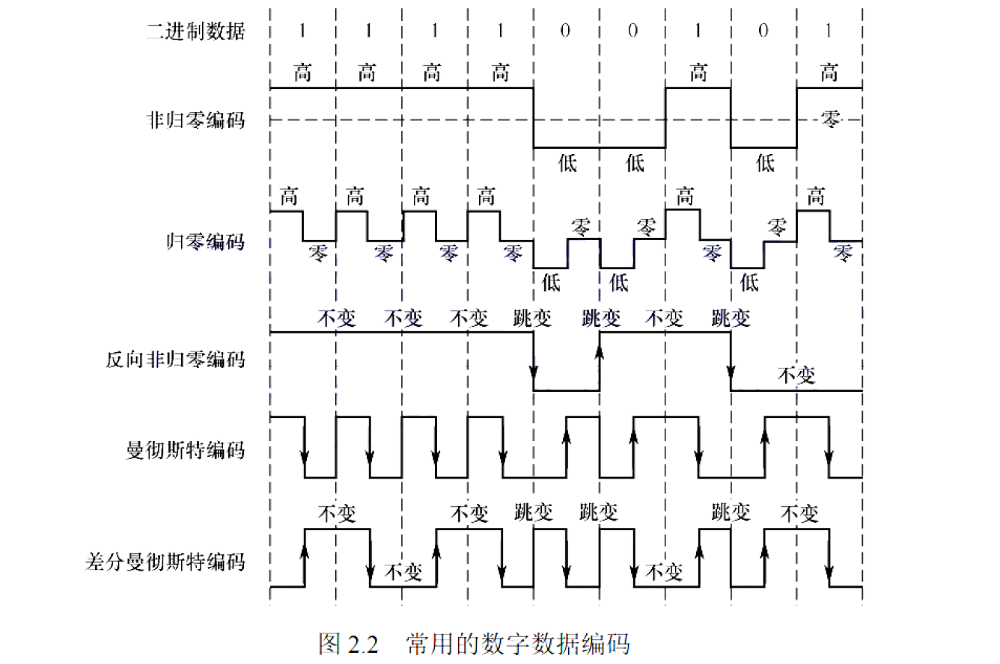
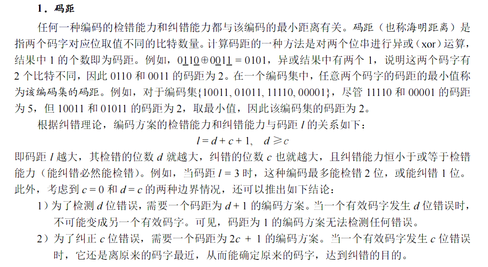
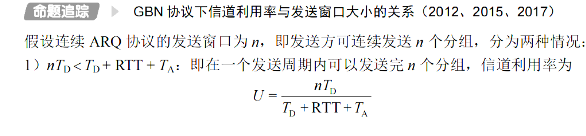
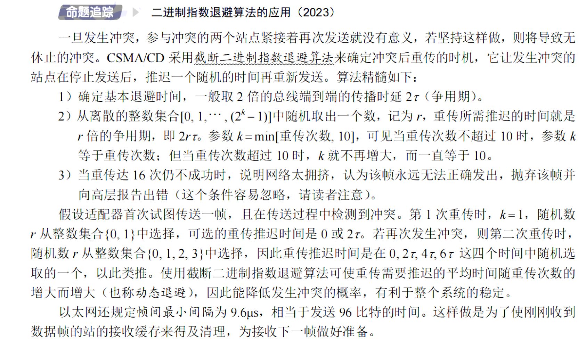

# 1.计算机网络体系结构

## 1.1计算机网络概述

## 1.2计算机网络体系结构和参考模型

### ISO/OSI

物链网输会示用

物理层的传输单位为比特

数据链路层传输单位为帧，节点之间的传输，差错控制，流量控制，点到点

网络层的传输单位为数据报，路由，拥塞控制

传输层：端到端，复用与分用

会话层：建立同步，会话，检查点

表示层：数据压缩，编码解码，加密解密

应用层：用户

### TCP/IP

传输层：TCP，UDP

应用层：FTP，DNS，SMTP，HTTP

### 差别

# 2.物理层

## 2.1通信基础

## 2.2传输介质

## 2.3物理层设备

# 3.数据链路层

## 3.1数据链路层的功能

## 3.2组帧

## 3.3差错控制

## 3.4流量控制和可靠传输机制

ARQ（自动重传请求）：停止等待协议（S-W）；后退N帧协议（GBN）；选择重传协议（SR）

后退N帧协议   发送窗口为$2^n-1$

选择重传协议  接受窗口为$2^{n-1}$

## 3.5介质访问控制

### 信道划分

时分复用（TDM）

频分复用（FDM）

波分复用（WDM）

码分复用（CDM（A））

### 随机访问

#### ALOHA

##### 纯ALOHA

##### 时隙ALOHA

#### CSMA

#### CSMA/CD

争用期：往返传播时延   64B  512bit  以太网

最短帧长=最大单向传播时长$\times$2$\times$数据传播速率=往返传播时延$\times$数据传播速率

#### CSMA/CA

## 3.6局域网

以太网帧 数据46-1000字节              （46=64-18）

802.1Q    数据46字节->42字节，最大长度不变，以太网帧最大1518字节  ->1522字节     

## 3.7广域网

## 3.8数据链路层设备

MAC地址长度为6B

# 4.网络层

## 4.1网络层的功能

## 4.2IPV4

418,首总偏

## 4.3IPV6

## 4.4路由算法和路由协议

## 4.5IP多播

## 4.6移动IP

## 4.7网络层设备

# 5.传输层

## 5.1传输层提供的服务

## 5.2UDP

## 5.3TCP

# 6.应用层

## 6.1网络应用模型

## 6.2域名系统

## 6.3文件传输协议

## 6.4电子邮件

## 6.5万维网