# 1.计算机网络体系结构

## 1.1计算机网络概述

7，12，13

### 1.

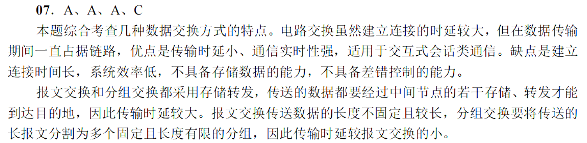

### 2.

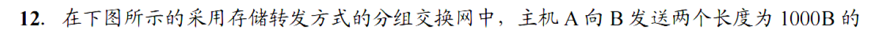

### 3.

### 真题

可以不参考答案。

15：分组传播可以相当于一个流水线，相当于一条已经连接好的电路交换（总传输文件大小的发送时延）+一个分组的发送时延（或多个，取决于路由器的多少）（不考虑传播时延）。

报文交换相当于不太聪明的流水线，需要等文件在完整到达一个路由器之后，再进行传输。

14：可计算出总的发送时延为80ms，最短路径上有两个路由器，需要加上2个分组的发送时延0.16ms

16：不考虑路由器，两段单向传播时延为0.02ms，文件的总发射时延为80ms，加上1个分组的发送时延0.08ms

## 1.2计算机网络体系结构和参考模型

10，12，18，20，22，23，27，37

### 1.

A

### 2.

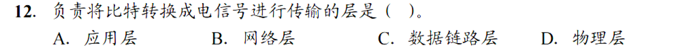

D

### 3.

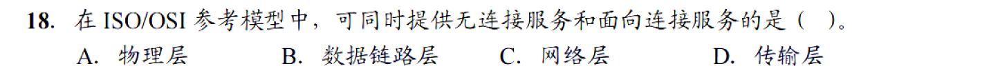

##### 得记住：

### 4.

### 5.

### 6.

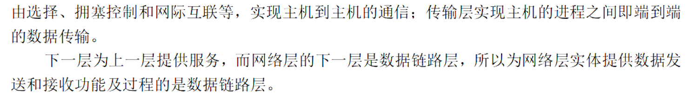

### 7.

### 8.

# 2.物理层

## 2.1通信基础

4，5，7，10，12，13，14，15，18，21，27

### 1.

### 2.

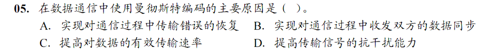

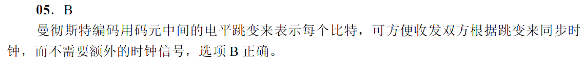

### 3.

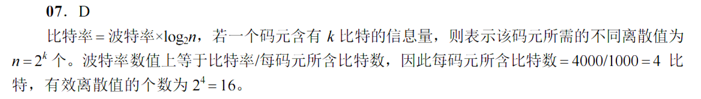

### 4.

### 5.

### 6.

### 7.

A

### 8.

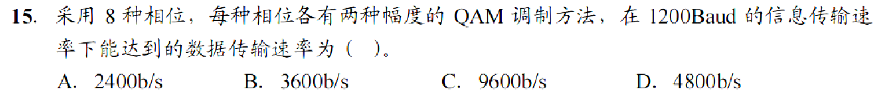

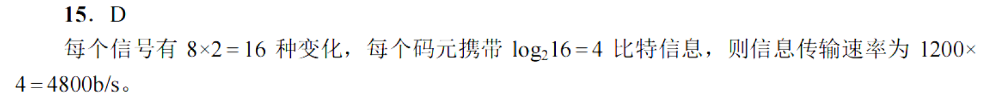

### 9.

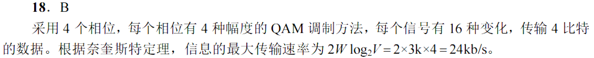

### 10.

### 11.

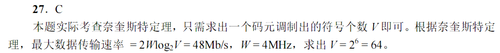

### 真题

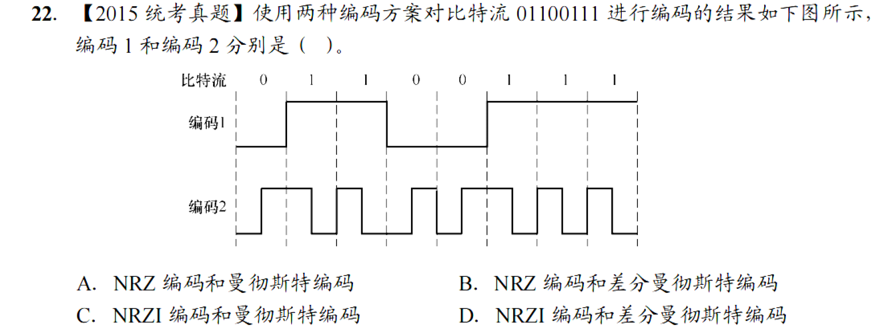

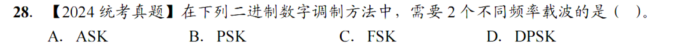

## 2.2传输介质

3，6，10，12

### 1.

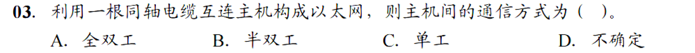

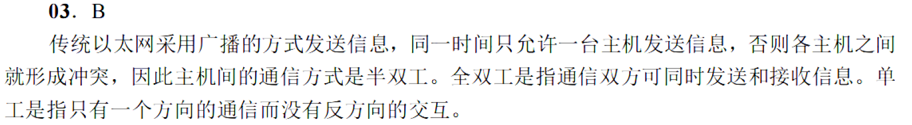

### 2.

### 3.

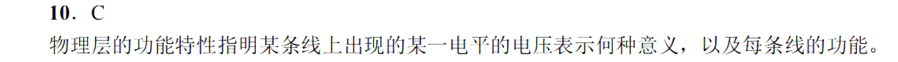

### 4.

## 2.3物理层设备

4

# 3.数据链路层

## 3.1数据链路层的功能

3，4

### 1.

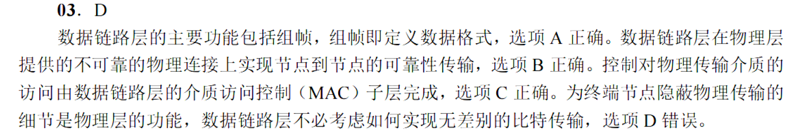

### 2.

D

## 3.2组帧

真题1

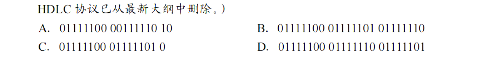

## 3.3差错控制

3

### 1.

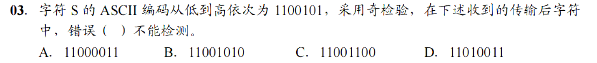

### 2.

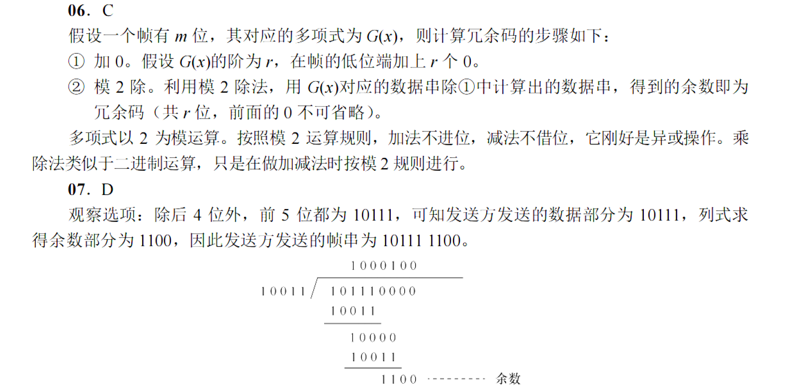

7的答案有问题

### 3.

## 3.4流量控制和可靠传输机制

5，9，10，11，13，19，21，23，25，29，30

### 1.

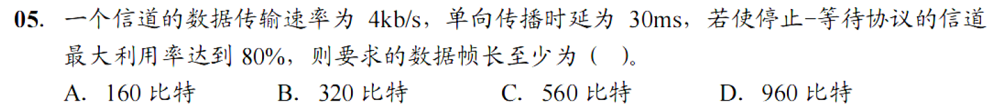

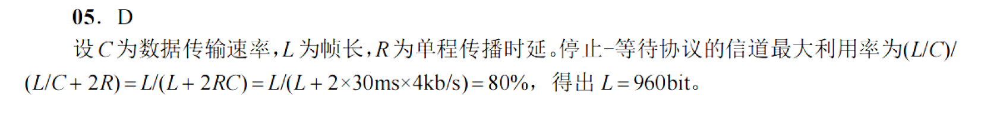

### 2.

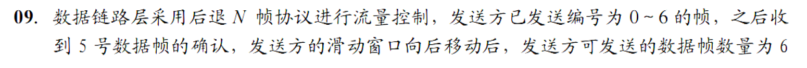

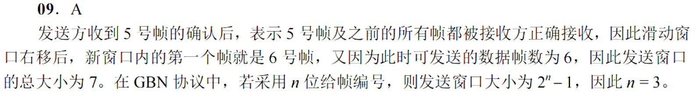

### 3.

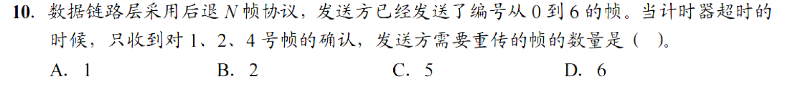

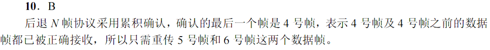

### 4.

### 5.

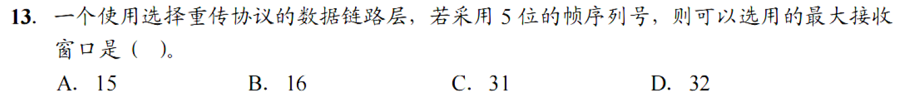

### 6.

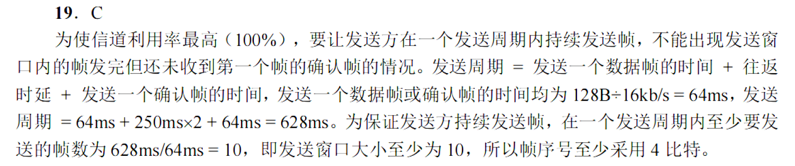

### 7.

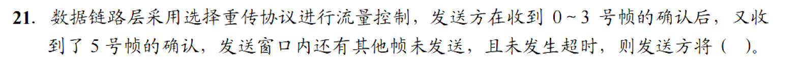

### 8.

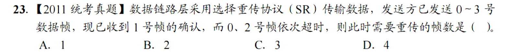

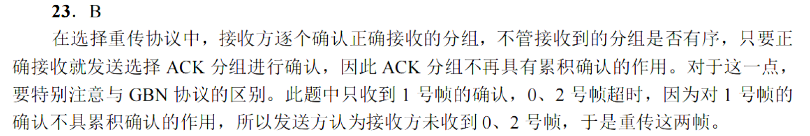

### 9.

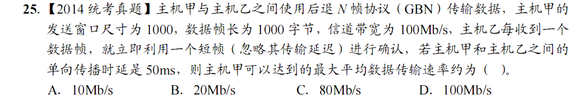

### 10.

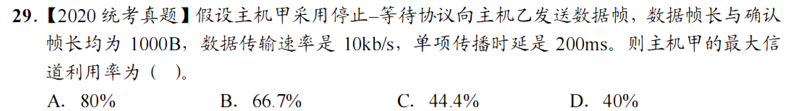

### 11.

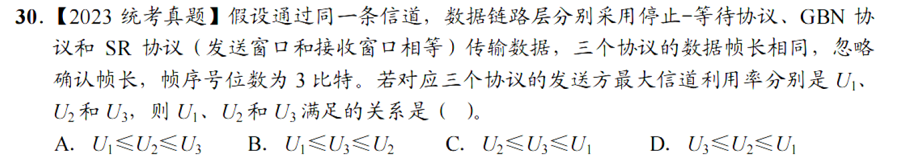

### P.S.单位转化成数据量而非时间可以简化运算

### 真题：

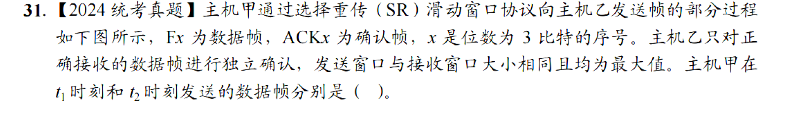

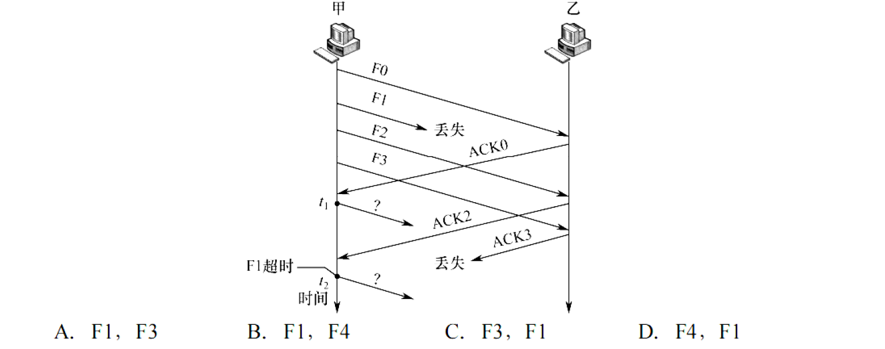

## 3.5介质访问控制

4，11，13，15，17，19，21，27，29，30，35，38，41，42

### 1.

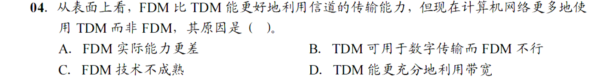

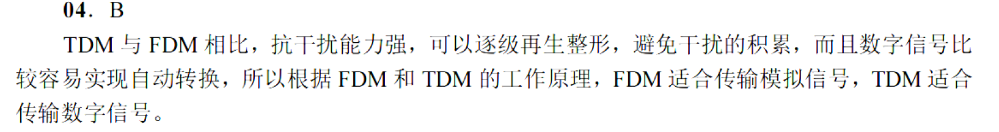

### 2.

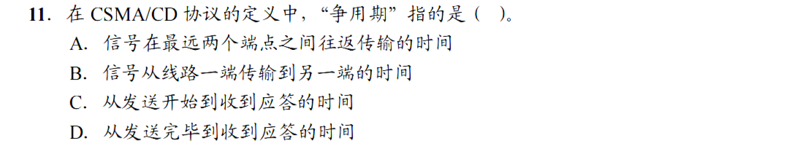

### 3.

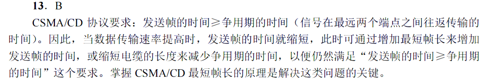

### 4.

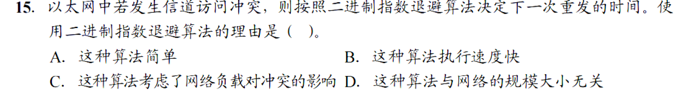

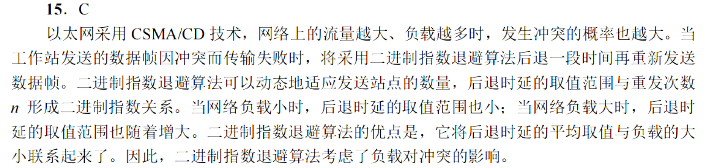

### 5.

### 6.

### 7.

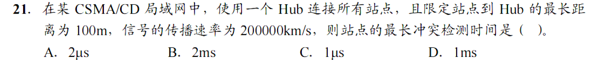

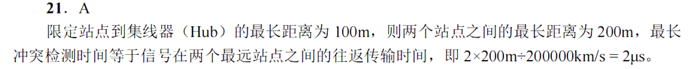

### 8.

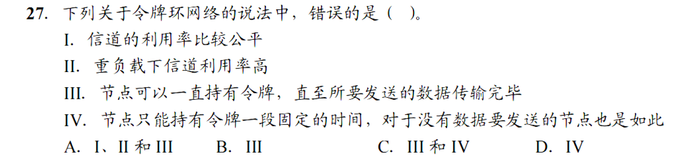

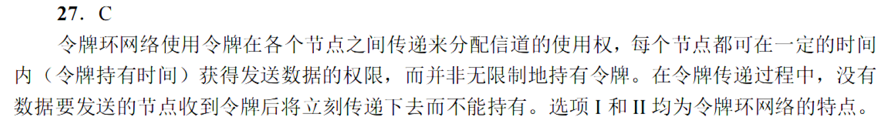

### 9.

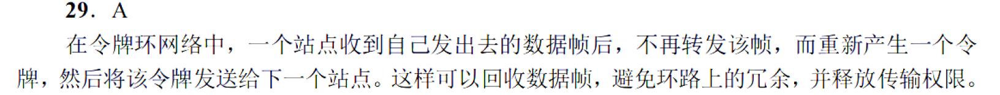

### 10.

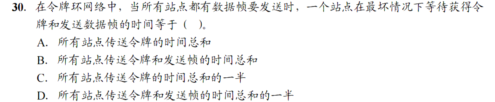

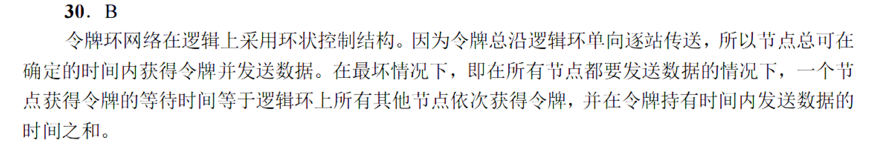

### 11.

### 12.

### 13.

### 14.

### 15.

### 真题：

D

B

、

B

D

## 3.6局域网

1，6，7，9，10，11，14，15，18，19，22，23，26

### 1.

### 2.

### 3.

B

### 4.

### 5.

### 6.

### 7.

A

### 8.

### 9.

### 10.

### 11.

C

### 12.

### 13.

A

### 14.

### 15.

## 3.7广域网（忽略）

3，6，7，8

### 1.

### 2.

### 3.

### 4.

## 3.8数据链路层设备

1，2，3，11，18，21

### 1.

### 2.

### 3.

### 4.

### 5.

### 6.

# 4.网络层

## 4.1网络层的功能

5，9，13，18，19，21

### 1.

### 2.

### 3.

### 4.

### 5.

### 6.

### 真题：

## 4.2IPV4

1，2，4，10，11，12，15，17，18，19，21，22，23，24，27，29，34，35，36，38，40，45，46，48，50，60，62，64，65，66，67，69，70

### 1.

### 2.

### 3.

### 4.

B（答案是B，但A似乎也不对）

### 5.

### 6.

### 7.

D类多播地址，阴的没边

### 8.

### 9.

### 10.

### 11.

### 12.

### 13.

### 14.

### 15.

### 16.

阴的一蹋糊涂

### 17.

### 18.

### 19.

### 20.

### 21.

有点难

### 22.

### 23.

### 24.

### 25.

### 26.

### 27.

### 28.

### 29.

### 30.

### 31.

### 32.

### 33.

A

### 真题：

## 4.3IPV6

6

### 1.

### 真题：

## 4.4路由算法和路由协议

15，18，21，22，23，24，25

### 1.

### 2.

### 3.

### 4.

### 5.

### 6.

### 7.

### 真题：

## 4.5IP多播

2

## 4.6移动IP

3

D

## 4.7网络层设备

1，7，10，15，16，18，21

### 1.

### 2.

### 3.

### 4.

### 5.

D

### 6.

### 7.

# 5.传输层

## 5.1传输层提供的服务

8

## 5.2UDP

3，8，11，12

## 5.3TCP

9，10，13，14，15，16，22，23，26，27，31，32，33，34，39，44，49，60

# 6.应用层

## 6.1网络应用模型

## 6.2域名系统

6，11，12，14

## 6.3文件传输协议

9，1，0，112，13

## 6.4电子邮件

8，11

## 6.5万维网

1，7，11，12，13，14，15，17，18